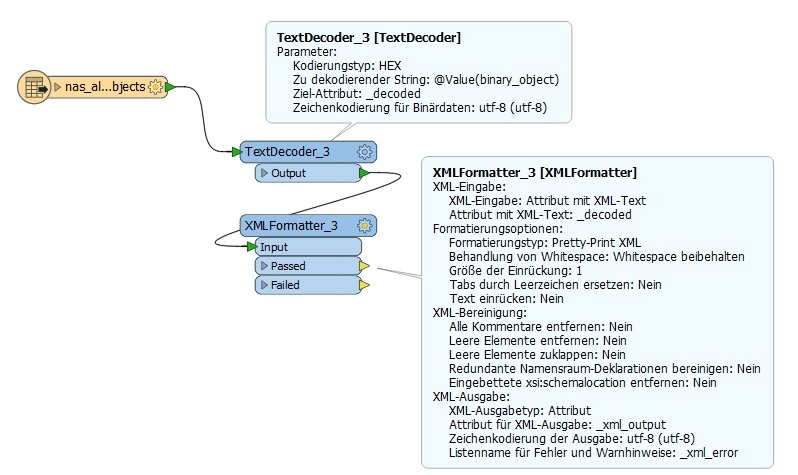

#

Simple NAS-File Loader - python multiprocessing
===============================================

## Inhalt
* [Einleitung](#einleitung)
* [deegree SQLFeatureStore](#deegree-sqlfeaturestore)
* [Python Multiprocessing](#python-multiprocessing)
* [FME Transformation](#fme-transformation)
* [Summary](#summary)


## Einleitung
Im Beitrag [GML-File Loader](https://github.com/enatgvhh/gmlloader) bin ich im letzten Kapitel bereits auf die Nachnutzung für NAS-Files eingegangen. Das python-package 'nasloader4' stimmt weitgehend mit dem package 'gmlloader4' überein, ist aber aufgrund der angeführten Punkte etwas leichter. Der Schwerpunkt dieses Beitrages soll deshalb mehr auf der praktischen Umsetzung, auf dem Multiprocessing sowie der Weiterverarbeitung mit der Feature Manipulation Engine (FME) liegen.

Das python-package 'nasloader4' und ein Client sind im Ordner [src](src) zu finden. Das Multiprocessing ist im Quellcode nicht enthalten, da es eine sehr individuelle Lösung ist. Ich werde es hier nur anhand von Codeschnipseln darstellen.


## deegree SQLFeatureStore
Den Inhalt der NAS-Files laden wir in eine PostgreSQL/PostGIS Datenbank (*deegree SQLFeatureStore im BLOB-Modus*). In diesem FeatureStore wird ein xml-Objekt einfach in einem BLOB-Attribut gespeichert. Das [sql-File](sql/nas_alkis.sql) zum Anlegen der Datenbanktabellen kann mit dem 'deegree-gml-tool' generiert werden. Das deegree Konfigurationsfile benötigen wir i.d.F. nicht, da wir die Datenbanktabellen nicht für einen Webservice, sondern nur als Zwischenspeicher verwenden werden und können.


## Python Multiprocessing
Ziel der praktischen Umsetzung ist es, das Veränderungen der NAS-Files (*ALKIS, ATKIS*) selbständig erkannt werden. Bei einem Change, wird der Ladevorgang in die Datenbank gestartet. Daran anschließend erfolgt über FME eine Transformation in das INSPIRE Zielschema.

Um das Ganze permanent im Hintergrund laufen zu lassen, legen wir eine Klasse an, welche die Basisklasse 'multiprocessing.Process' um unsere Client-Funktionalität erweitert. Im Konstruktor dieser Klasse rufen wir als erstes den super-Konstruktor der Basisklasse auf. Dann überschreiben wir die Instanzmethode 'run' der Basisklasse.
```
class MultiprocessLoaderAlkis(multiprocessing.Process):
    def __init__ (self, path, hashFile):
        multiprocessing.Process.__init__(self)
        self.__path = path
        self.__hashFile = hashFile
        self.__BLOCKSIZE = 65536
        
    def run(self):
        while True:
            self.checkHash()
            time.sleep(86400)
            
    def checkHash(self):
		pass #...
```
Von unserer Klasse initialisieren wir eine Instanz und starten den Multiprozess, der nach getaner Arbeit für 24h schläft. Im Codeausschnitt werden 3 Multiprozesse parallel gestartet. 
```
from myThreads import multiprocessLoaderAlkis
from myThreads import multiprocessLoaderAtkis
from myThreads import multiprocessLoaderSIB

if __name__ == "__main__":
    processAlkis = multiprocessLoaderAlkis.MultiprocessLoaderAlkis(r'E:\Data\ALKIS\ALKIS_HH_unzip', r'E:\logs\hash_alkis.txt')
    processAlkis.start()
    processAtkis = multiprocessLoaderAtkis.MultiprocessLoaderAtkis(r'E:\Data\ATKIS\ATKIS_HH_unzip', r'E:\logs\hash_atkis.txt')
    processAtkis.start()
    processSib = multiprocessLoaderSIB.MultiprocessLoaderSIB(r'E:\Data\hhsib\SIB_inspire\Inspire_HH.xml', r'E:\logs\hash_sib.txt')
    processSib.start()
```
Die Veränderung der NAS-Files erkennen wir über Hash-Summen, die wir ganz einfach in einem File abspeichern.
```
def checkHash(self):
        hashDict = {}
        hashChanged = False
        
        if os.path.isfile(self.__hashFile):
            reader = open(self.__hashFile, "r")
        
            for line in reader:
                zeile = line.rstrip("\n").split("\t")
                hashDict.update({zeile[0]: zeile[2]})
        
            reader.close()
            os.remove(self.__hashFile)
            
        writer = open(self.__hashFile, "a")
           
        if os.path.exists(self.__path) == True:
            if os.path.isdir(self.__path) == True:
                objects = os.listdir(self.__path)
                if objects:
                    for objectElement in objects:
                        element = os.path.join(self.__path, objectElement)
                        hasher = hashlib.sha256()     
                        with open(element, 'rb') as afile:
                            buf = afile.read(self.__BLOCKSIZE)          
                            while len(buf) > 0:
                                hasher.update(buf)
                                buf = afile.read(self.__BLOCKSIZE)
                
                        newHash = hasher.hexdigest()
                        writer.write(element + "\tSHA256:\t" + newHash + "\n")
                        
                        for dictKeyType, dictValueType in hashDict.items():
                            if dictKeyType == element:
                                if newHash != dictValueType:
                                    hashChanged = True
                                    
                                break
        writer.close()
		
        if hashChanged == True:
            print("hash changed, start MultiprocessLoaderAlkis!")
            self.loader()
        else:
            print("hash not changed, sleep MultiprocessLoaderAlkis!")
```
Und die FME Workbench können wir über einen python-subprocess starten…


## FME Transformation
In der FME Workbench greifen wir mit einem PostGIS-Reader auf die Daten zu, decodieren den Inhalt des Attributes 'binary_object' (*vgl. Abb. 1 bzw. [GML_Objects_BLOB_Decoder](https://hub.safe.com/publishers/enatgvhh/transformers/gml_objects_blob_decoder)*) und extrahieren mit 'XMLXQueryExtractor' Transformern (*xpath/xquery*), die benötigten Informationen. Gegenüber der SQL-Welt hat das den großen Vorteil, dass wir alle AAA-Objektarten generisch verarbeiten können.


Abb. 1: PostGIS-Reader und BLOB-Dekodierung

Produktiv verwende ich den ALKIS- und den ATKIS-Zwischenspeicher aber letztendlich nur für die Transformation in das INSPIRE Zielschema 'Geographical Names'. Ansonsten werden die AdV-Daten über die HALE [AdV INSPIRE alignments](https://github.com/enatgvhh/hale-adv) transformiert. Dieses führte bei den 'Geographical Names' aber zu sehr großen und völlig unbrauchbaren Ergebnissen. Das mit den sehr großen Datenergebnissen kann man bei den AdV INSPIRE alignments  häufig beobachten, z.B. entsteht für das INSPIRE Thema 'Cadastral parcels' in Hamburg ein 1,8 GB großes GML-File. Lade ich das mit dem deegree GML-Loader in die Datenbank, verbleiben dort 360 MB. Da frage ich mich, was ist da noch alles in dem GML-File drin?


## Summary
Der vorgestellte Ansatz bietet eine Möglichkeit, wie sich die AAA-Daten auf recht unkomplizierte Weise für die INSPIRE Transformation verwenden lassen. Möchte man die AdV-Daten vollständig über diesen Workflow laufen lassen, sollte man den Sachverhalt noch etwas genauer evaluieren, insbesondere ob tatsächlich alle AAA-Geometrien im XML-Element 'position' verortet sind. Davon bin ich hier ausgegangen, kenne mich aber mit dem AAA-Modell nicht wirklich aus. Und an dem Code bedarf es entsprechender Änderungen, da jetzt zum Beispiel in der Klasse 'NasLoader' nur Objekte berücksichtigt werden, die über eine Geometrie (*position*) und einen Wert im Attribut 'name' verfügen.

Die Grundidee hinter diesem Ansatz ist die, dass man nicht für jede Transformation immer alle NAS-Files durchlaufen muss, sondern gezielt die benötigten Objektarten selektiert. Auf diese Idee sind natürlich schon andere gekommen. So lassen sich mit [norGIS-ALKIS-Import](https://www.norbit.de/68/) ALKIS-Daten in eine PostgreSQL/PostGIS Datenbank laden. Für dieses Datenmodell gibt es dann wiederum entsprechende HALE AdV INSPIRE alignments. Ansprechpartner hierfür ist die AdV. Wie gut das funktioniert, darüber kann ich keine Aussage treffen.
